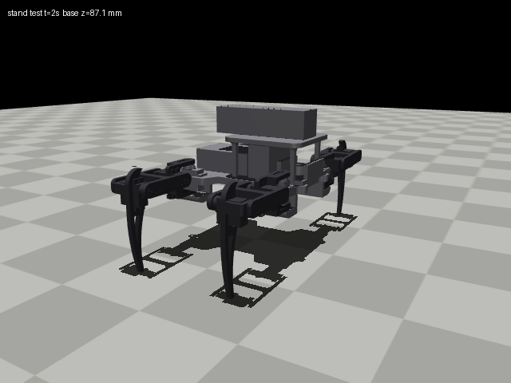
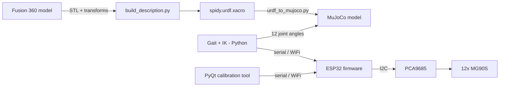

# Spidy Bot

A 3D-printed, 12-servo quadruped built from scratch. It's being taught to walk in simulation first (MuJoCo), then on the real hardware.

<p align="center">
  
</p>

> Learning project. The goal is a robot that crawls, turns and takes gamepad input, and an understanding of every layer on the way there: CAD → URDF → physics sim → kinematics → gait → firmware.

## Status

- [x] Mechanical design (Fusion 360), printed and assembled
- [x] Power system: 3S LiPo → 12 A buck @ 6 V → custom distribution board
- [x] ESP32 + PCA9685 firmware with a serial / WiFi-TCP command protocol
- [x] PyQt calibration and pose tool; sit ↔ stand works
- [x] URDF/xacro generated from the CAD, with per-link meshes and mass properties
- [x] MuJoCo model: stands in sim, torque audit per servo
- [ ] Real masses (weigh parts) and zero-pose calibration
- [ ] Leg inverse kinematics
- [ ] Crawl gait + turning in sim
- [ ] Sim2real bridge (same gait code drives sim and robot)
- [ ] Gamepad control, IMU levelling

## Hardware

| | |
|---|---|
| Actuators | 12× MG90S metal-gear micro servos (3 per leg) |
| Servo driver | PCA9685, 16-channel PWM @ 50 Hz |
| Controller | ESP32 |
| Power | 3S LiPo 2200 mAh, 12 A buck converter set to 6 V |
| IMU | MPU6050 (fitted, not used yet) |
| Frame | PLA, Fusion 360 |

Leg geometry: coxa 34.2 mm, femur 55.8 mm, tibia 88.9 mm. Estimated mass ~730 g.

## How it fits together



## Repository layout

| Path | What's inside |
|---|---|
| `Codess/Software/esp32_receiver/` | Main ESP32 firmware: line protocol → PCA9685 |
| `Codess/Software/spidy_Caliberation.py` | Desktop tool: per-servo calibration, saving and playing poses |
| `Codess/Software/*.txt` | Current calibration and saved poses |
| `Codess/*` | Small bring-up sketches (I2C check, servo sweep, centring) |
| `URDF/spidy_description/` | URDF/xacro, meshes, MuJoCo model, build scripts ([README](URDF/spidy_description/README.md)) |
| `URDF/raw_world_stl/` | Per-component STLs exported from Fusion (input to the URDF build) |
| `Final Parts/`, `Models/`, `*.3mf` | Printable parts and slicer projects |

## Quick start

**Simulation** (Windows/Linux/macOS, Python 3.10+):

```bash
pip install -r URDF/spidy_description/requirements.txt
python -m mujoco.viewer --mjcf=URDF/spidy_description/mujoco/spidy.xml
```

Open the *Control* panel in the viewer and drag the 12 joint sliders.

**Firmware:**

1. Copy `Codess/Software/esp32_receiver/secrets.example.h` to `secrets.h` and add your WiFi details.
2. Flash `esp32_receiver.ino` with the Arduino IDE. It needs the **Adafruit PWM Servo Driver** library.
3. Connect with the calibration tool: `pip install pyqt5 pyserial`, then `python Codess/Software/spidy_Caliberation.py`.

**Command protocol** (USB serial 115200, or TCP port 5000):

```
POSE,<12 angles>[,ms]   smooth move to a pose
M,<id>,<pulse>          raw pulse to one channel
ESTOP                   all servos off
```

## Conventions

- Frames follow ROS REP-103: x forward, y left, z up. SI units.
- Zero pose = femurs horizontal, tibias vertical (the CAD pose).
- All legs use the same joint axes; left/right mirroring is handled in software.

## Lessons so far

- **Sequencing beats power.** Sit → stand only worked after reordering the motion (ankle → knee → posture).
- **The PCA9685 is a signal board.** Servo current needs its own thick distribution path.
- **Two ground paths caused a ground loop**, which made the servos whine.
- **The sim points at the front-leg weakness.** With estimated masses the COM sits ~12 mm forward, so the front hip servos work ~50% harder than the rear ones. To be confirmed with real masses.
